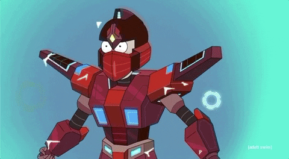

## Hello folks😃

 

In this repository, you will find how to create a virtual character whose statements will be based on a transcript of one of my favorite animated science fiction sitcom "[Rick and Morty](https://en.wikipedia.org/wiki/Rick_and_Morty)".  

You can use characters and sitcoms of your own choice by downloading and training the dataset. I used [Open AI's GPT-2](https://openai.com/blog/gpt-2-1-5b-release/) model to train my dataset. Also, I added code to convert a regular text file with dialogs into a format that the model understands. 

>### For more discord development action by me visit [here](https://github.com/FRe324/DiscordBot). 
 

 

### !! Happy Coding !!
